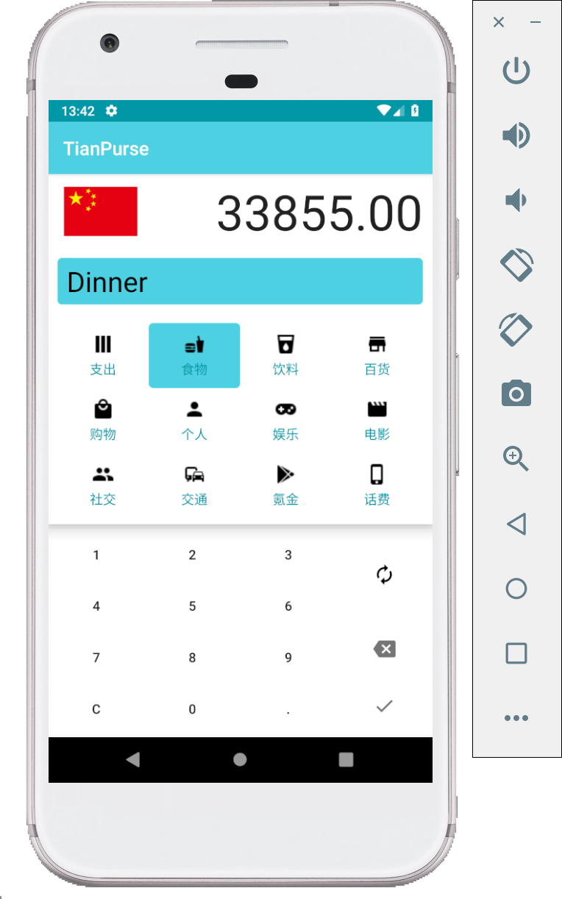
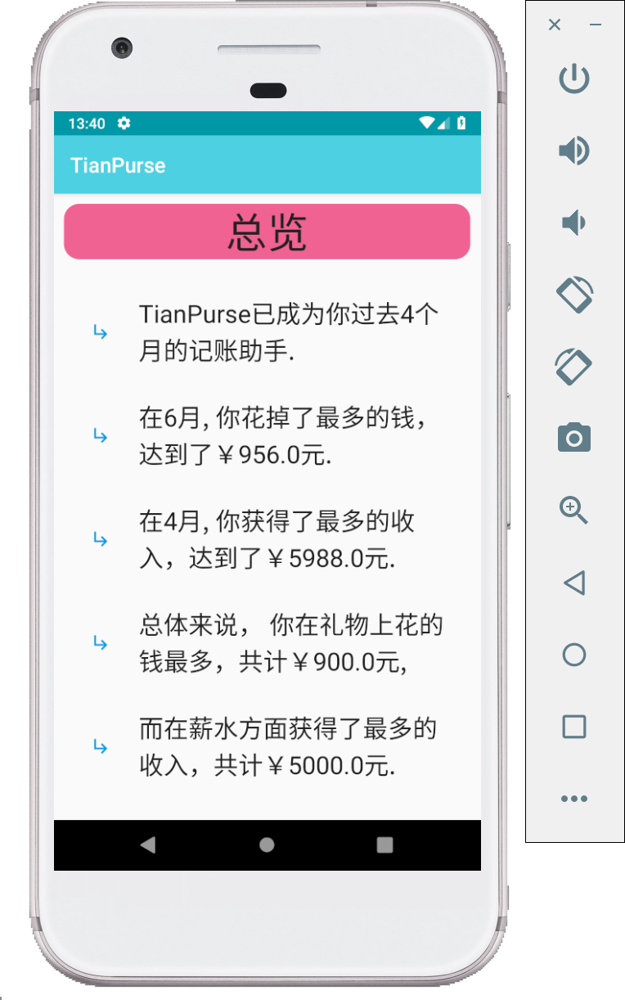
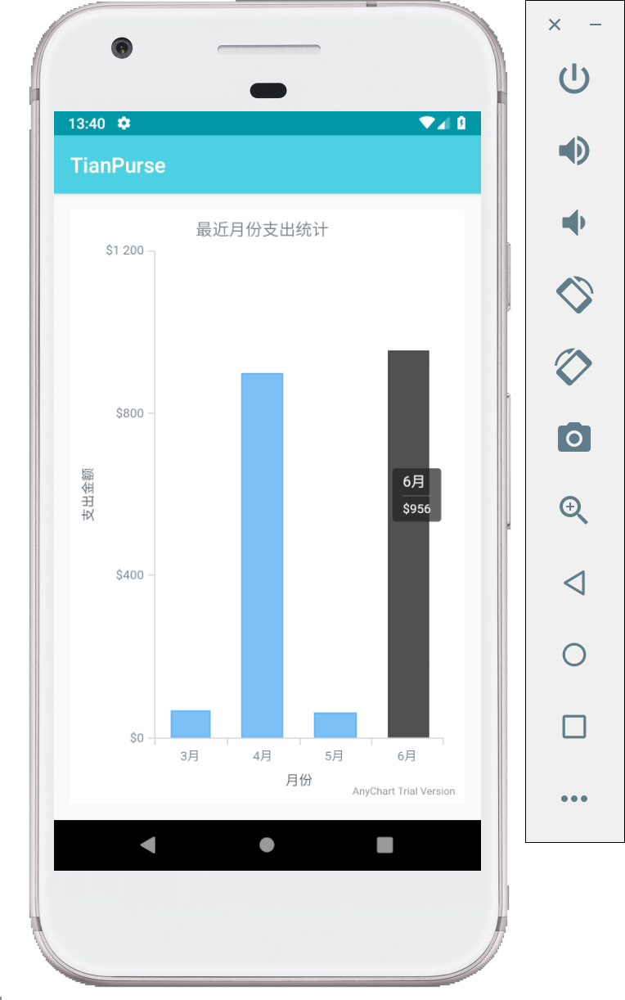
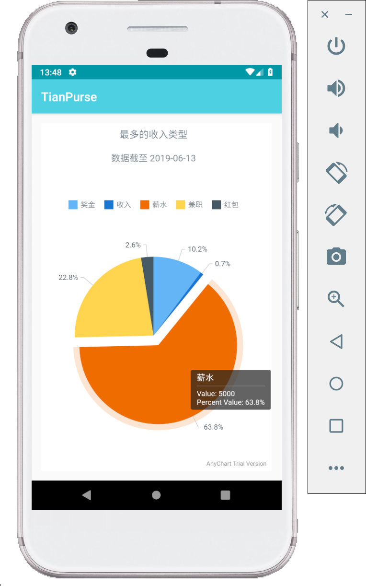

# Android记账App: TianPurse

## ⚠️注意
* 根据要求强行编写12个activity，代码可能存在不合理之处。
* 图标非开源，项目不可商用。
* 参考B站项目改编。

## 📱界面&功能介绍

* APP图标

    

* 主界面
    * 主界面显示今天的收支情况。
    * 左右滑动可以查看前一天后一天。
    * 下拉列表可以刷新。

    

* 添加条目页面
    * 可以添加今天的收入，支出。
    * 点击按钮切换收支类型。
    * 输入框输入备注。

    

* 添加过去的条目页面
    * 可以补记过去的条目。
    * 点击日期回到今天。

    

* 菜单

    

* 统计页面
    * 共五个条目，最后的更多有待补充。

    

* 统计页面：总览
    * 总览信息。

    

* 统计页面：每月支出
    * 以柱状图显示每个月的支出。

    

* 统计页面：每月收入
    * 以柱状图显示每月收入

    

* 统计页面：支出大头
    * 以饼图显示支出最多的类目

    

* 统计页面：收入来源
    * 以饼图显示收入的主要来源

    

* 关于页面
    * 显示应用的版本号，作者（activity凑数）。

    

* 更新页面
    * 更新应用（没卵用，activity凑数）。

    

* shortcuts
    * 几个常用功能添加shortcuts。
    * 最简单的静态添加。

    

* TODO
    * 年份
    * 代码优化重构
